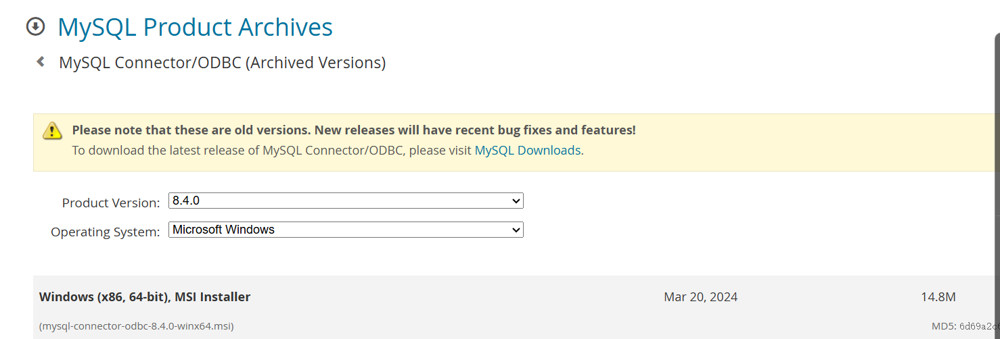
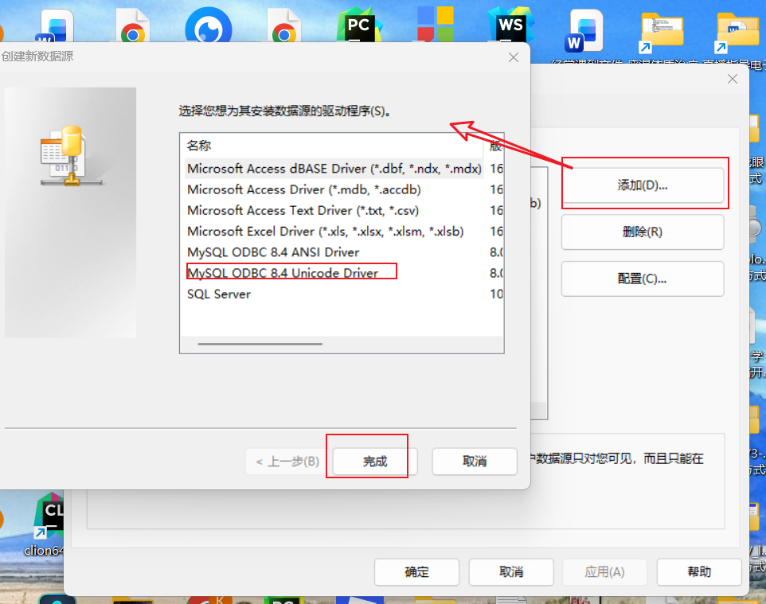
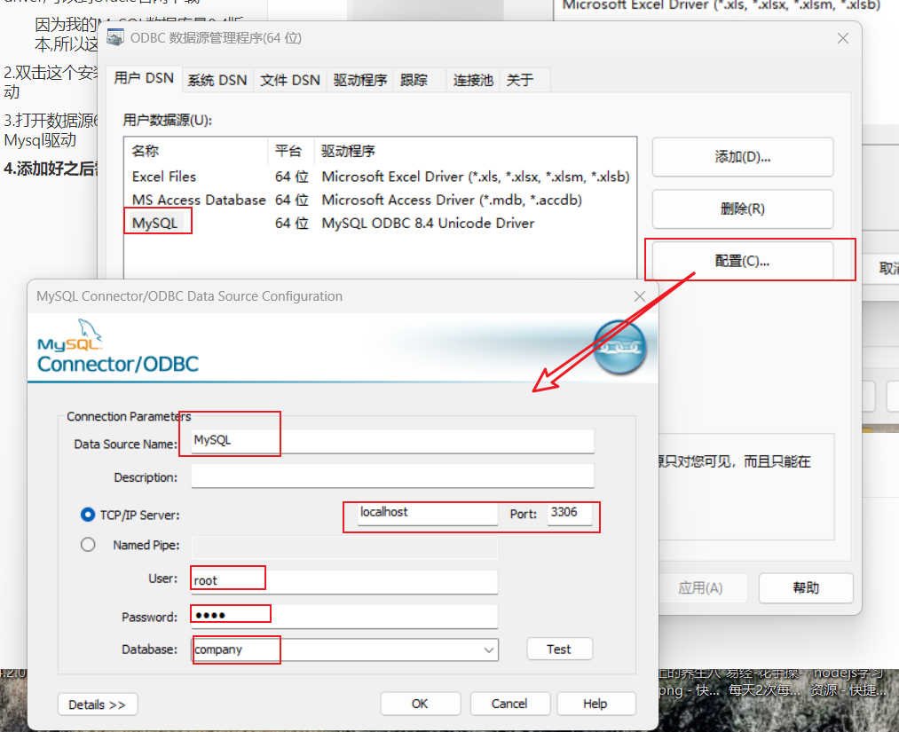
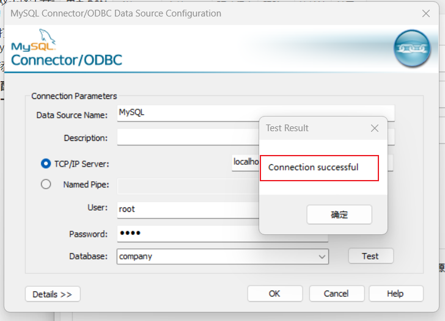

## 1.首先需要安装MySQL ODBC driver,可以到Oracle官网下载

#### 因为我的MySQL数据库是8.4版本,所以这里需要下载8.4版本的



## 2.双击这个安装程序就可以安装驱动

## 3.打开数据源64位配置工具,添加Mysql驱动



## 4.添加好之后需要配置



###  配置好后可以点击测试按钮测试一下



## 5.写代码

### 5.1 查询数据

```vbs
'查询数据
'需要安装mysql-connector-odbc-8.4.0-winx64.msi : https://downloads.mysql.com/archives/get/p/10/file/mysql-connector-odbc-8.4.0-winx64.msi
strConn="Driver={MySQL ODBC 8.4 Unicode driver};SERVER=127.0.0.1;port=3306;UID=root;PWD=root;DATABASE=company;"
Set conn = CreateObject("ADODB.Connection")

conn.Open strConn

strsql = "select * from admin"
Set rs = CreateObject("adodb.recordset")
rs.Open strsql,conn,1,3
 WScript.Echo "id  " & "  " & "userName" & " " & "pwd" 
Do Until rs.EOF
  WScript.Echo rs.Fields("id") & "     " & rs.Fields("userName") & "   " & rs.Fields("pwd")
  rs.MoveNext
Loop

rs.Close
conn.Close
Set rs = Nothing
Set conn = Nothing

```

### 5.2数据的增删改

```vbs
'需要安装mysql-connector-odbc-8.4.0-winx64.msi : https://downloads.mysql.com/archives/get/p/10/file/mysql-connector-odbc-8.4.0-winx64.msi
strConn="Driver={MySQL ODBC 8.4 Unicode driver};SERVER=127.0.0.1;port=3306;UID=root;PWD=root;DATABASE=company;"
Set conn = CreateObject("ADODB.Connection")

conn.Open strConn
' add data
' strsql = "insert into admin values('10','Kenny','12345');"
' update data
' strsql = "update admin set userName='Ken' where id=8;"
strsql = "update admin set id=9 where id=10;"
' delete data
' strsql = "delete from admin where id=9;"
conn.Execute(strsql)
conn.Close

Set conn = Nothing

```

#### 一定要注意链接字符串的写法

```vbs
strConn="Driver={MySQL ODBC 8.4 Unicode driver};SERVER=127.0.0.1;port=3306;UID=root;PWD=root;DATABASE=company;"
```


