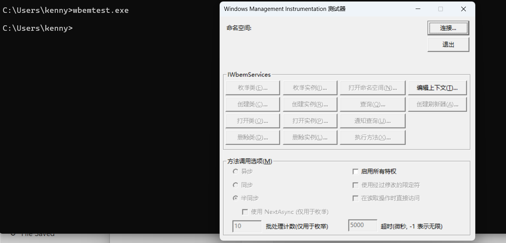

### 0.一个好用的vbs编辑软件绿色版,可以参考wmi类

#### 下载地址: https://storage.googleapis.com/google-code-archive-downloads/v2/code.google.com/zxstd/VBSedit%E7%A0%B4%E8%A7%A3%E7%89%88.rar

### 0.25 windows自带一个wmi查看工具,wbemtest.exe



### 0.5 WMI入门参考

网址: https://www.cnblogs.com/dongzhiquan/archive/2009/04/29/1994887.html


### 1.查看Bios信息

```WMI-vbs
strComputer = "."
Set objWMIService = GetObject("winmgmts:" _
    & "{impersonationLevel=impersonate}!\\" & strComputer & "\root\CIMV2")

Set colBIOS = objWMIService.ExecQuery _
    ("Select * from Win32_BIOS")

For each objBIOS in colBIOS
    Wscript.Echo "Manufacturer: " & objBIOS.Manufacturer
    Wscript.Echo "Name: " & objBIOS.Name
    Wscript.Echo "Serial Number: " & objBIOS.SerialNumber
    Wscript.Echo "SMBIOS Version: " & objBIOS.SMBIOSBIOSVersion
    Wscript.Echo "Version: " & objBIOS.Version
Next
```

### 2.**使用** **WMI** **和** **VBScript** **检索总物理内存**

```WMI bvs
strComputer = "."
Set objWMIService = GetObject("winmgmts:\\" & strComputer & "\root\cimv2")
Set colItems = objWMIService.ExecQuery("Select * from Win32_PerfFormattedData_PerfOS_Memory",,48)
strService = ""

For Each objItem in colItems
    strService = strService &  "AvailableBytes: " & objItem.AvailableBytes & vbCrLf
    strService = strService &  "AvailableKBytes: " & objItem.AvailableKBytes  & vbCrLf
    strService = strService &  "AvailableMBytes: " & objItem.AvailableMBytes  & vbCrLf
    strService = strService &  "CacheBytes: " & objItem.CacheBytes  & vbCrLf
    strService = strService &  "CacheBytesPeak: " & objItem.CacheBytesPeak  & vbCrLf
    strService = strService &  "CacheFaultsPersec: " & objItem.CacheFaultsPersec  & vbCrLf
    strService = strService &  "Caption: " & objItem.Caption  & vbCrLf
    strService = strService &  "CommitLimit: " & objItem.CommitLimit  & vbCrLf
    strService = strService &  "CommittedBytes: " & objItem.CommittedBytes  & vbCrLf
    strService = strService &  "DemandZeroFaultsPersec: " & objItem.DemandZeroFaultsPersec  & vbCrLf
    strService = strService &  "Description: " & objItem.Description  & vbCrLf
    strService = strService &  "FreeSystemPageTableEntries: " & objItem.FreeSystemPageTableEntries  & vbCrLf
    strService = strService &  "Frequency_Object: " & objItem.Frequency_Object  & vbCrLf
    strService = strService &  "Frequency_PerfTime: " & objItem.Frequency_PerfTime  & vbCrLf
    strService = strService &  "Frequency_Sys100NS: " & objItem.Frequency_Sys100NS  & vbCrLf
    strService = strService &  "Name: " & objItem.Name  & vbCrLf
    strService = strService &  "PageFaultsPersec: " & objItem.PageFaultsPersec  & vbCrLf
    strService = strService &  "PageReadsPersec: " & objItem.PageReadsPersec  & vbCrLf
    strService = strService &  "PagesInputPersec: " & objItem.PagesInputPersec  & vbCrLf
    strService = strService &  "PagesOutputPersec: " & objItem.PagesOutputPersec  & vbCrLf
    strService = strService &  "PagesPersec: " & objItem.PagesPersec  & vbCrLf
    strService = strService &  "PageWritesPersec: " & objItem.PageWritesPersec  & vbCrLf
    strService = strService &  "PercentCommittedBytesInUse: " & objItem.PercentCommittedBytesInUse  & vbCrLf
    strService = strService &  "PoolNonpagedAllocs: " & objItem.PoolNonpagedAllocs  & vbCrLf
    strService = strService &  "PoolNonpagedBytes: " & objItem.PoolNonpagedBytes  & vbCrLf
    strService = strService &  "PoolPagedAllocs: " & objItem.PoolPagedAllocs  & vbCrLf
    strService = strService &  "PoolPagedBytes: " & objItem.PoolPagedBytes  & vbCrLf
    strService = strService &  "PoolPagedResidentBytes: " & objItem.PoolPagedResidentBytes  & vbCrLf
    strService = strService &  "SystemCacheResidentBytes: " & objItem.SystemCacheResidentBytes  & vbCrLf
    strService = strService &  "SystemCodeResidentBytes: " & objItem.SystemCodeResidentBytes  & vbCrLf
    strService = strService &  "SystemCodeTotalBytes: " & objItem.SystemCodeTotalBytes  & vbCrLf
    strService = strService &  "SystemDriverResidentBytes: " & objItem.SystemDriverResidentBytes  & vbCrLf
    strService = strService &  "SystemDriverTotalBytes: " & objItem.SystemDriverTotalBytes  & vbCrLf
    strService = strService &  "Timestamp_Object: " & objItem.Timestamp_Object  & vbCrLf
    strService = strService &  "Timestamp_PerfTime: " & objItem.Timestamp_PerfTime  & vbCrLf
    strService = strService &  "Timestamp_Sys100NS: " & objItem.Timestamp_Sys100NS  & vbCrLf
    strService = strService &  "TransitionFaultsPersec: " & objItem.TransitionFaultsPersec  & vbCrLf
    strService = strService &  "TransitionPagesRePurposedPersec: " & objItem.TransitionPagesRePurposedPersec  & vbCrLf
    strService = strService &  "WriteCopiesPersec: " & objItem.WriteCopiesPersec  & vbCrLf
Next

WScript.Echo strService


```

### 3.**使用** **WMI** **和** **VBScript** **检索服务信息**

```WMI VBS

strComputer = "."
strService = ""


Set wbemServices = Getobject("winmgmts:\\" & strComputer)

Set wbemObjectSet = wbemServices.InstancesOf("Win32_Service")


For Each wbemObject In wbemObjectSet

    strService = strService & "Display Name:  " & wbemObject.DisplayName & vbCrLf & _
         "   State:      " & wbemObject.State       & vbCrLf & _
         "   Start Mode: " & wbemObject.StartMode

Next

WScript.Echo strService
```

### 4.读取Windows事件日志记录

```WMI vbs
' List All Events from an Event Log
On Error Resume Next 
strComputer = "."
strInfo=""
Set fs = CreateObject("Scripting.FileSystemObject")
Set ts = fs.OpenTextFile("./logdata.txt",2,True)
Set objWMIService = GetObject("winmgmts:" _
    & "{impersonationLevel=impersonate}!\\" & strComputer & "\root\cimv2")

Set colLoggedEvents = objWMIService.ExecQuery _
    ("Select * from Win32_NTLogEvent Where Logfile = 'Application'")

For Each objEvent in colLoggedEvents
    ts.WriteLine  "Category: " & objEvent.Category & vbCrLf
    ts.WriteLine  "Computer Name: " & objEvent.ComputerName & vbCrLf
    ts.WriteLine  "Event Code: " & objEvent.EventCode & vbCrLf
    ts.WriteLine  "Message: " & objEvent.Message & vbCrLf
    ts.WriteLine  "Record Number: " & objEvent.RecordNumber & vbCrLf
    ts.WriteLine  "Source Name: " & objEvent.SourceName & vbCrLf
    ts.WriteLine  "Time Written: " & objEvent.TimeWritten & vbCrLf
    ts.WriteLine  "Event Type: " & objEvent.Type & vbCrLf
    ts.WriteLine  "User: " & objEvent.User & vbCrLf
    ts.WriteLine  "======================================" & vbCrLf
    
Next
ts.Close()
set ts = Nothing
set fs = Nothing

```

